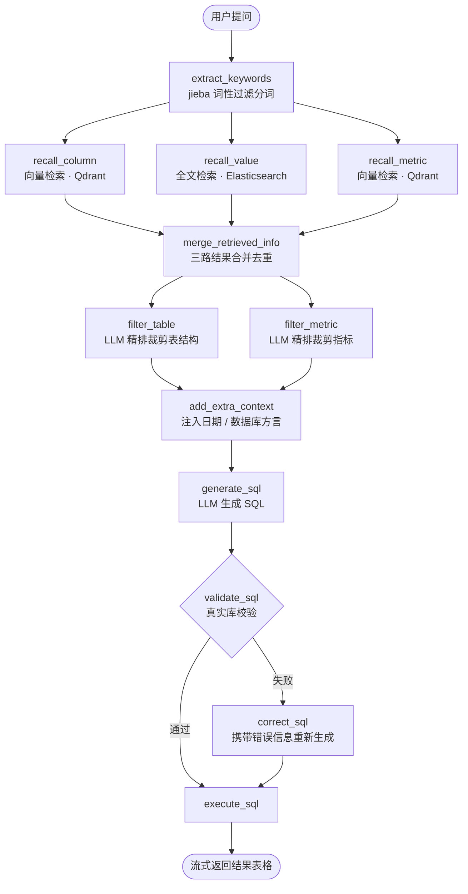

# Enterprise Text2SQL Agent

> 面向企业数仓的自然语言问数系统。用户用中文提问，Agent 自动完成元数据召回、SQL 生成、校验纠错与执行，流式返回查询结果。


<!-- 录好演示 GIF 后，把下面这行的注释符去掉即可 -->
<!--  -->

---

## 这个项目解决什么问题

业务人员想看数据，但不会写 SQL；数据分析师被大量重复的取数需求淹没。

直接把「表结构 + 用户问题」丢给大模型让它生成 SQL，在玩具场景能跑通，在真实数仓里会立刻崩掉：

| 真实场景的难点 | 本项目的应对 |
| --- | --- |
| 数仓有几百张表，全部塞进 Prompt 会超长且干扰模型 | 两级召回：先粗召回候选，再由 LLM 精排裁剪 |
| 用户说「销售额」，数仓字段叫 `gmv` | LLM 关键词扩展 + 别名库，跨越口语与数仓术语的语义鸿沟 |
| 用户说「华东地区」，需要知道这是 `region_name` 的一个**取值** | 字段取值单独建全文索引，与字段名检索分离 |
| 「去年」「上个季度」模型无法推算 | 运行时注入当前日期、星期、季度 |
| 模型生成的 SQL 有语法错或字段不存在 | 真实数据库校验，失败后带错误信息重新生成 |
| 一次查询要走十几步，用户干等着不知道进度 | 每个节点通过 SSE 推送执行状态，前端实时渲染 |

---

## 系统架构

### 在线查询链路

基于 LangGraph 编排的 12 节点有向图，包含并行扇出、条件分支两种拓扑：



### 离线元知识库构建

查询链路依赖的元数据由 `build_meta_knowledge` 脚本离线构建，三类知识分别落到最适合它的存储：

| 知识类型 | 存储 | 检索方式 | 为什么这样选 |
| --- | --- | --- | --- |
| 表 / 字段的语义描述与别名 | Qdrant | 向量相似度 | 字段名是**语义**的，「销售额」和 `gmv` 字面零重合但语义相近 |
| 字段的实际取值 | Elasticsearch | 全文检索 | 取值是**字面**的，「华东」必须精确命中，向量化反而引入噪声 |
| 业务指标定义与口径 | Qdrant | 向量相似度 | 指标名同样是语义匹配问题 |
| 元数据结构化信息 | MySQL (`meta`) | 主键查询 | 召回后按 ID 回表拿完整定义 |

> **按数据性质选择检索方式**是本项目的核心设计决策之一。把字段取值也做向量化，会让「华东」召回出「华南」「东北」这类语义相近但业务上完全错误的结果。

---

## 技术栈

| 分层 | 选型 |
| --- | --- |
| Agent 编排 | LangGraph 1.0（`StateGraph` + `context_schema` 依赖注入 + `stream_writer` 自定义流） |
| 大模型 | DeepSeek（OpenAI 兼容接口，可替换为通义 / 智谱 / 任意兼容服务） |
| Embedding | BAAI/bge-large-zh-v1.5，经 HuggingFace TEI 本地部署 |
| 向量库 | Qdrant |
| 全文检索 | Elasticsearch 8 |
| 关系库 | MySQL 8（`meta` 元数据库 + `dw` 数仓库双数据源） |
| 分词 | jieba（按词性白名单过滤） |
| 后端 | FastAPI + SQLAlchemy 2.0 async + asyncmy |
| 前端 | Vue 3 + Vite（SSE 流式渲染） |
| 日志 | loguru + `contextvars` 实现请求级 `request_id` 追踪 |
| 配置 | OmegaConf 结构化配置 + 环境变量注入 |

---

## 快速开始

### 1. 准备依赖服务

```bash
# Qdrant
docker run -d -p 6333:6333 --name qdrant qdrant/qdrant

# Elasticsearch 8
docker run -d -p 9200:9200 --name es \
  -e "discovery.type=single-node" -e "xpack.security.enabled=false" \
  docker.elastic.co/elasticsearch/elasticsearch:8.15.0

# Embedding 服务（TEI）
docker run -d -p 8081:80 --name tei \
  ghcr.io/huggingface/text-embeddings-inference:cpu-latest \
  --model-id BAAI/bge-large-zh-v1.5
```

MySQL 需自行准备，并创建 `meta`（元数据）与 `dw`（数仓）两个库。

### 2. 配置环境变量

```bash
cd backend
cp .env.example .env
```

编辑 `.env` 填入数据库账号与大模型 API Key：

```ini
DB_META_USER=your_mysql_user
DB_META_PASSWORD=your_mysql_password
DB_DW_USER=your_mysql_user
DB_DW_PASSWORD=your_mysql_password

LLM_MODEL_NAME=deepseek-flash
LLM_API_KEY=sk-xxxxxxxxxxxxxxxx
LLM_BASE_URL=https://api.deepseek.com
```

> 服务地址、端口等非敏感项在 `conf/app_config.yaml` 中配置。所有凭据均通过 `${oc.env:...}` 从环境变量注入，仓库内不含任何真实密钥。

### 3. 构建元知识库

```bash
uv sync
uv run python -m app.scripts.build_meta_knowledge -c conf/meta_config.yaml
```

该脚本读取 `conf/meta_config.yaml` 中的表结构、字段别名与指标定义，写入 MySQL 元数据库，并将字段 / 指标向量化入 Qdrant、字段取值同步入 Elasticsearch。

### 4. 启动服务

```bash
# 后端 → http://localhost:8000
uv run python main.py

# 前端 → http://localhost:5173
cd ../frontend
npm install
npm run dev
```

打开前端页面即可提问，例如：**「统计去年各地区的销售总额」**。

---

## 项目结构

```
├── backend/
│   ├── app/
│   │   ├── agent/            # LangGraph 编排
│   │   │   ├── graph.py      #   图定义：节点、边、条件分支
│   │   │   ├── state.py      #   状态 Schema
│   │   │   └── nodes/        #   12 个节点实现
│   │   ├── api/              # FastAPI 路由、请求模型、依赖注入
│   │   ├── clients/          # 外部服务连接管理（生命周期 init/close）
│   │   ├── repositories/     # 数据访问层，按存储拆分
│   │   ├── services/         # 业务编排层
│   │   ├── conf/             # 配置 Schema 与加载
│   │   └── core/             # 日志、请求上下文
│   ├── conf/                 # YAML 配置与数仓元数据定义
│   ├── prompts/              # Prompt 模板（与代码分离，便于迭代）
│   └── main.py               # 应用入口 + request_id 中间件
└── frontend/                 # Vue 3 聊天界面
```

---

## 工程实践

- **分层清晰**：`clients` 管连接生命周期、`repositories` 管数据访问、`services` 管业务编排、`api` 管协议适配，跨层调用通过依赖注入完成。
- **双数据源隔离**：元数据库与数仓库使用独立的连接池与 Session 工厂，避免误操作跨库写入。
- **Prompt 与代码分离**：全部 Prompt 存放于 `prompts/` 目录，调整措辞无需改动代码、无需重启进程。
- **配置外部化**：敏感凭据一律经环境变量注入，仓库提供 `.env.example` 模板，`.env` 由 `.gitignore` 拦截。
- **请求级链路追踪**：中间件为每个请求生成 `request_id`，经 `contextvars` 透传至全部日志，多请求并发时日志不串。
- **全链路异步**：数据库、向量库、ES、LLM 调用均为 async，单进程即可支撑并发查询。

---

## 评测结果

> 🚧 评测体系建设中，指标将在此处更新。

| 指标 | 基线 | 优化后 |
| --- | --- | --- |
| SQL 执行准确率 | 待测 | 待测 |
| 字段召回 Recall@5 | 待测 | 待测 |
| 端到端 P95 延迟 | 待测 | 待测 |

---

## Roadmap

- [ ] **评测体系**：构建黄金问题集，实现执行准确率 / 召回率自动化评测，支持每次策略变更后回归
- [ ] **并行召回优化**：当前多关键词 Embedding 为串行循环，改造为 `asyncio.gather` 并发，降低召回阶段延迟
- [ ] **纠错闭环**：`correct_sql` 后回流至 `validate_sql` 形成带上限的重试循环，替代当前的单次纠错
- [ ] **模型分级路由**：SQL 生成与纠错节点使用强模型，关键词扩展等轻量节点使用快模型，降低单次查询成本
- [ ] **语义缓存**：对高相似度的重复提问复用历史结果
